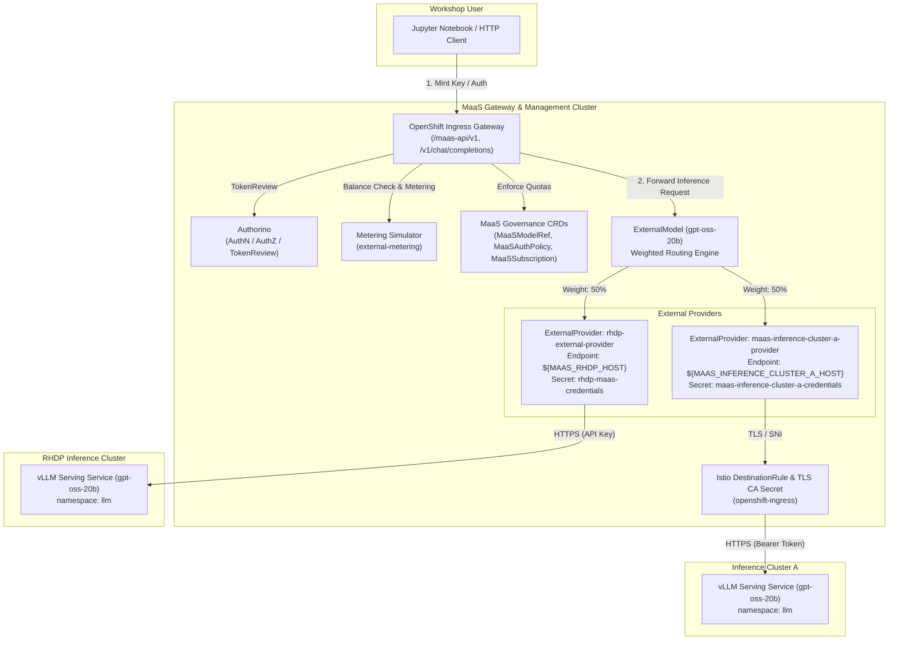
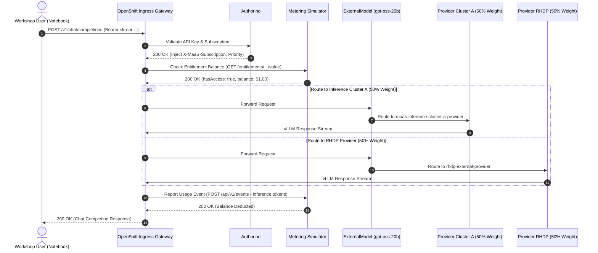

# RHOAI Models-as-a-Service (MaaS) Workshop

This repository contains workshop materials, manifests, and interactive guides demonstrating **Models-as-a-Service (MaaS)** capabilities on **Red Hat OpenShift AI (RHOAI)**.

It illustrates how platform operators and consumers manage the full lifecycle of AI models: deploying large language models (LLMs), defining access control policies, managing tiered subscriptions with token rate limits, connecting external model providers, and integrating usage metering.

---

## Key Components

- **Model Deployments & Subscriptions (`models/`)**
  Kustomize manifests for deploying LLMs (such as `gpt-oss-20b` and `qwen3-06b`) with associated OpenShift AI MaaS custom resources:
  - `MaaSModelRef`: Model registration and reference to inference services.
  - `MaaSAuthPolicy`: Group- and user-based access control.
  - `MaaSSubscription`: Tiered subscription definitions (e.g., Free vs. Premium tiers) configuring token rate limits and quotas.

- **External Model Providers (`external-models/`)**
  Configurations to proxy and route inference traffic to external providers (such as OpenAI or remote inference clusters) using `ExternalModel` resources, credential secrets, and TLS destination rules.

- **MaaS API Specification (`maas-api/`)**
  OpenAPI 3.0 specification (`openapi3.yaml`) for the MaaS management and billing API, detailing endpoints for health checks, model discovery, subscription inspection, and API key management.

- **External Metering Simulator (`external-metering/`)**
  A lightweight, OpenMeter-compatible mock HTTP service and payload processing plugin manifests to simulate customer entitlements, quota enforcement, and per-inference balance deduction.

- **Interactive Notebooks (`notebooks/`)**
  A step-by-step Jupyter notebook (`openshift-user-maas-interaction.ipynb`) and presentation utilities (`maas_notebook_utils.py`) walking through:
  1. Authenticating via OpenShift CLI (`oc`) tokens.
  2. Listing accessible subscriptions and models via the MaaS API.
  3. Generating temporary MaaS API keys.
  4. Running model inference while observing real-time metering and entitlement checks.
  5. Revoking API keys.

- **Helper Scripts (`scripts/`)**
  `render.sh`: Utility script to render Kustomize manifests with scoped variable substitution via `envsubst` and optionally apply them via `oc apply`.

---

## Repository Structure

```text
├── external-metering/       # Metering plugins and OpenMeter simulator service
├── external-models/         # Manifests for integrating external model providers
├── maas-api/                # OpenAPI 3.0 specification for the MaaS API
├── models/                  # LLM deployment manifests and tiered subscription CRs
├── notebooks/               # Hands-on Jupyter notebook and helper utilities
├── pyproject.toml           # Python project definition and dependencies
├── scripts/                 # Utility scripts (manifest rendering, deployment)
└── uv.lock                  # Lockfile for reproducible Python dependencies
```

---

## Architecture & Multi-Cluster Topology

The workshop supports a dual-cluster deployment model separating model serving workloads from API governance:

1. **Model Inference Cluster**:
   - An OpenShift cluster running Red Hat OpenShift AI (RHOAI) and KServe / vLLM.
   - Hosts the actual LLM serving workloads in namespace `llm` (e.g. `LLMInferenceService`).
   - Operates purely as an inference cluster: does **not** require the MaaS operator or MaaS custom resource definitions (`MaaSModelRef`, `MaaSAuthPolicy`, `MaaSSubscription`).
2. **MaaS Management & Gateway Cluster**:
   - An OpenShift cluster running the RHOAI MaaS control plane, OpenShift Ingress Gateway, Authorino (API authorization and token review), and Envoy payload processing plugins.
   - Hosts the external metering simulator in namespace `external-metering`.
   - Manages API routing and quotas via `ExternalModel`, `ExternalProvider`, Istio `DestinationRule`, and MaaS governance CRDs (`MaaSModelRef`, `MaaSAuthPolicy`, `MaaSSubscription`).



### End-to-End Inference Message Flow



---

## Operational Runbook

Follow this sequence to deploy and validate the workshop environment.

### Phase 1: Deploying to Model Inference Cluster

Deploy the base model to an inference cluster without installing MaaS CRDs.

1. **Connect to the Inference Cluster:**
   ```bash
   oc login --token=<INFERENCE_CLUSTER_TOKEN> --server=<INFERENCE_CLUSTER_API_URL>
   ```

2. **Deploy Model Serving Workload:**
   - For `gpt-oss-20b` (requires NVIDIA GPU):
     ```bash
     oc apply -k models/gpt-oss-20b
     ```
   - For `qwen3-06b` (runs on CPU):
     ```bash
     oc apply -k models/qwen3-06b
     ```

3. **Verify Inference Service Deployment:**
   ```bash
   oc get llminferenceservice -n llm
   oc get pods -n llm -w
   ```
   Both base model kustomizations create only the `llm` namespace and the `LLMInferenceService` workload without requiring MaaS CRDs.

---

### Phase 2: Deploying to MaaS Management & Gateway Cluster

Configure the MaaS gateway, metering simulator, and external proxy routing on the management cluster.

1. **Connect to the MaaS Management Cluster:**
   ```bash
   oc login --token=<MANAGEMENT_CLUSTER_TOKEN> --server=<MANAGEMENT_CLUSTER_API_URL>
   ```

2. **Deploy the External Metering Simulator:**
   Deploy the simulator manifests and initiate a binary source build directly from the local repository:
   ```bash
   # Create namespace, imagestream, buildconfig, deployment, and service
   oc apply -f external-metering/simulator/simulator-openshift.yaml

   # Build container image from local directory
   oc start-build external-metering-simulator \
       --from-dir=external-metering/simulator \
       -n external-metering --follow

   # Wait for deployment rollout
   oc rollout status deployment/external-metering-simulator -n external-metering
   ```

3. **Configure Gateway Payload Processing Plugins:**
   Apply the Envoy `PayloadProcessorConfig` plugins and NetworkPolicy allowing egress from the gateway to the metering simulator:
   ```bash
   oc apply -f external-metering/payload-processing-plugins.yaml
   ```

4. **Connect External Inference Cluster via ExternalModel Proxy:**
   Set up environment variables in `.env` (refer to `.env.example`):
   ```bash
   cp .env.example .env
   ```
   Configure the following variables in `.env`:
   - `MAAS_INFERENCE_CLUSTER_A_HOST`: Route domain of the remote inference cluster A.
   - `MAAS_INFERENCE_CLUSTER_A_TOKEN`: Bearer token for accessing remote cluster A.
   - `MAAS_RHDP_HOST`: Route domain of the external RHDP inference cluster.
   - `MAAS_RHDM_API_KEY`: API key for external RHDP provider.

   Render and apply certificates and DestinationRule:
   ```bash
   ./scripts/render.sh external-models/inference-cluster-certs --apply
   ```

   Render and apply `ExternalModel`, provider credentials, and MaaS governance subscriptions:
   ```bash
   ./scripts/render.sh external-models/openai --apply
   ```

5. **(Optional) Local Model Governance Manifests:**
   If running MaaS governance against models deployed on the same cluster, apply the standalone governance manifests:
   ```bash
   oc apply -k models/gpt-oss-20b/maas
   # or
   oc apply -k models/qwen3-06b/maas
   ```

---

### Phase 3: Workshop Client Interaction

1. **Install Python Dependencies:**
   ```bash
   uv sync
   # or with pip:
   pip install -e .
   ```

2. **Configure Client Environment in `.env`:**
   - `KUBECONFIG`: Path to active kubeconfig.
   - `MAAS_GATEWAY_URL`: Base gateway URL for the MaaS cluster.
   - `MAAS_SUBSCRIPTION`: Target subscription name (e.g. `gpt-oss-20b-free` or `qwen3-06b-free`).
   - `MAAS_MODEL`: Target model identifier (`gpt-oss-20b` or `qwen3-06b`).

3. **Launch the Workshop Notebook:**
   ```bash
   uv run jupyter lab notebooks/openshift-user-maas-interaction.ipynb
   ```

---

## OpenAPI Contract & Source of Truth

The OpenAPI 3.0 specification located at [`maas-api/openapi3.yaml`](maas-api/openapi3.yaml) serves as the authoritative, immutable source of truth for the MaaS billing and management API contracts.

- **Immutability Policy**: `maas-api/openapi3.yaml` is strictly read-only.
- All client implementations, notebooks (`notebooks/openshift-user-maas-interaction.ipynb`), simulator endpoints (`external-metering/simulator/simulator.py`), and documentation adapt to conform to this contract.

---

## Running Tests

Unit tests for the metering simulator and notebook utilities can be executed with Python's test runner:

```bash
PYTHONPATH=notebooks:external-metering/simulator uv run python -m unittest external-metering/simulator/test_simulator.py external-metering/simulator/test_maas_notebook_utils.py
```
